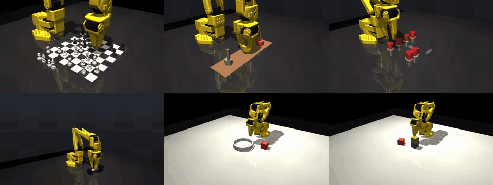
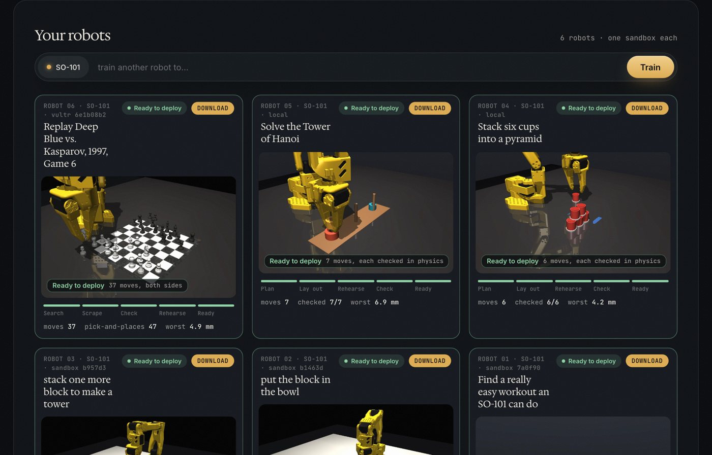
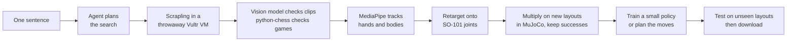

# Replay

**Robot skills from one sentence, learned from the open web.**

Type what you want an SO-101 robot arm to do. Replay searches the open web for people doing it and for the rules of
it, turns that into a skill for the arm, and checks every skill in physics before a robot ever runs it.

**[Try it](https://replay-so101.vercel.app)** · **[Skill library](https://replay-library.vercel.app)** ·
**[1-minute video](https://replay-so101.vercel.app/replay-demo.mp4)** · **[Slides](https://replay-so101.vercel.app/replay-slides.pdf)**



Built at **The Agent Arena** (Vultr x Cerebral Valley, San Francisco, September 2026), track *Future of Work: AI +
Robotics on Vultr*.

---

## The problem

ChatGPT learned by reading the internet. Robots can't. Every skill a robot has today was recorded by hand: a person
steers the arm, over and over, for one task, and a second task means starting again. The new robot models
(vision-language-action models, VLAs) are starving for exactly that data.

The internet already holds most of what a robot needs. **How people move** lives in video. **What the rules are**
lives in text. Replay turns both into robot skills, and nothing reaches the robot until it has worked in physics.

## What it has made

Six skills, six different kinds of task, all on a simulated SO-101 in MuJoCo:

| Skill | Learned from | How it was made | Result |
|---|---|---|---|
| **Deep Blue vs. Kasparov, 1997, Game 6**, both sides | Wikipedia, scraped with Scrapling | game checked move by move with python-chess; every grasp rehearsed in physics | 37 moves, 47 pick-and-places, worst placement 4.9 mm |
| **Dumbbell curl** | Creative Commons YouTube videos | MediaPipe Pose on every video; the arm copies the best person's elbow 1:1 | elbow within 1.25° of the human |
| **Block in the bowl** | real people's hands (HO-Cap, CC BY 4.0) | hand motion multiplied into 386 physics-checked demonstrations; small policy trained by imitation | **19/20** unseen layouts, trained in 21 s on a CPU |
| **Block tower** | same | 148 demonstrations, same pipeline | **18/20** unseen layouts |
| **Tower of Hanoi** | the rules | optimal 7-move plan (2^n - 1); every move rehearsed in physics | 7/7 moves, worst 6.9 mm |
| **Cup pyramid** | the rules | 3-2-1 layout from the cup size; every move rehearsed | 6/6 cups, worst 4.2 mm |

Every skill can be downloaded: a trained policy (`policy.pt`), a joint trajectory (`skill.csv`, 50 Hz, SO-101 joint
names), or a move plan with its physics checks (`moves.json`), plus the sources and their licences.



## How it works



1. **Plan.** An agent turns the sentence into a search plan: which exercise, task or game, and what to look for.
2. **Scrape safely.** Scrapling runs inside a throwaway Vultr VM, one per robot. It only keeps openly licensed
   material (Creative Commons video, Wikipedia) and checks the licence of every file before download.
3. **Check.** A vision model confirms each clip really shows the task; python-chess re-reads every scraped game.
4. **Track.** MediaPipe follows the person's hand or body in every frame.
5. **Retarget.** The motion is mapped onto the SO-101's joints. If the robot copying it fails in physics, the clip is
   dropped.
6. **Multiply.** Each good motion is replayed on hundreds of new table layouts in MuJoCo, and only the tries that
   actually work are kept. This is the same idea as NVIDIA's MimicGen, a few human demonstrations becoming hundreds of
   good robot ones, starting here from web video.
7. **Train or plan.** For the block tasks a small network (166k parameters) learns by imitation, predicting the next
   20 steps of joint commands at once (action chunking, as in Stanford's ALOHA/ACT work). For rule-based tasks the
   moves are planned and each one is rehearsed first.
8. **Test.** Policies are scored on 20 fixed layouts they never saw in training.

## Why Vultr

Reading the open web means following redirects, downloading whatever you are handed and reading text written to
hijack an agent. So every robot's scraping runs in **its own Vultr VM** (`vc2-1c-2gb`, one vCPU): a fresh SSH key,
a firewall that only admits the app, no secrets on the machine, and a hardened `docker run` inside (read-only root,
no capabilities, CPU, memory and time caps). The VM is deleted when the robot finishes, crashes or is killed. A warm
pool keeps one VM ready, so a new robot starts in seconds. The whole pipeline runs on CPU; no GPU anywhere.

Also built in: a **Kill** button per robot that destroys its sandbox at once, and a hash-chained **audit log** of every
fetch, block and model call (`GET /api/runs/{id}/audit`, `/audit/verify`).

## Run it locally

```bash
# sandbox image and the web app + API
(cd sandbox && docker build -t arena-scraper:0.1 .)
.venv/bin/python -m uvicorn arena.server:app --port 8800          # open http://localhost:8800

# the same, with one throwaway Vultr VM per robot
export VULTR_API_KEY=...                                          # from the dashboard, never written to a file
.venv/bin/python scripts/vultr.py check
SANDBOX_BACKEND=vultr .venv/bin/python -m uvicorn arena.server:app --port 8801
.venv/bin/python scripts/vultr.py sweep                           # after a crash: delete leftover VMs, firewalls, keys
```

Models are any OpenAI-compatible endpoint: `LLM_BASE_URL`, `LLM_MODEL`, `LLM_API_KEY` (plus `VLM_*` overrides).
MediaPipe runs from `POSE_PYTHON`. Optional: `VULTR_REGION` (sjc), `VULTR_PLAN` (vc2-1c-2gb), `VULTR_SNAPSHOT_ID`.

Other entry points:

- `scripts/task_render.py hanoi|cups` rehearses and films a planned task.
- `scripts/build_library.py` builds the skill library site.
- `scripts/build_app_static.py` builds the hosted app, where a typed prompt replays a recorded run and says so.
- Tests: `.venv/bin/python -m pytest tests/` (Vultr lifecycle against a fake API, the SSH path against local Docker).

## Repository map

| Path | What it is |
|---|---|
| `arena/server.py` | FastAPI app: runs, WebSocket events, downloads, audit log |
| `arena/sandbox/runner.py` | Docker and Vultr sandbox runners (VM per robot, warm pool, kill) |
| `sandbox/scraper/` | the scraper that runs inside the sandbox (Scrapling, yt-dlp with licence checks) |
| `arena/pipeline.py`, `arena/policy.py` | block tasks: retarget, physics gate, dataset, policy training and evaluation |
| `arena/workout/` | exercise copying: MediaPipe Pose, rep detection, the dumbbell scene |
| `arena/chess/` | the chess scene, move planning and rehearsal |
| `arena/tasks/` | Tower of Hanoi and cup pyramid: layouts, plans, physics checks |
| `web/` | the app (`index.html`, `site.js`) and the library page |

## Deployment: teacher-student distillation (planned)

The small policies above are the **teachers**. They solve the task because they are told where every object is. A
robot in the real world only has a camera and an instruction, so the deployed model has to learn to see. The plan
is two distillation steps, the second with [DistillKit](https://github.com/arcee-ai/DistillKit) (Arcee, Apache 2.0):

1. **Teachers make the data.** Run each working policy on thousands of new random layouts in MuJoCo, keep only the
   successes, and record what a VLA needs: camera frames, the instruction ("put the block in the bowl") and the joint
   commands. This is the privileged-teacher idea from "Learning by Cheating" (Chen et al., 2019): a teacher that knows
   the true state trains a student that only sees pixels.
2. **Train a large VLA on it.** Fine-tune a vision-language-action model whose actions are **tokens**, using the FAST
   action tokenizer (Physical Intelligence's π0-FAST), so acting becomes next-token prediction.
3. **Distill it into a small student with DistillKit.** DistillKit trains a student Transformer to match a teacher's
   token distributions (KL) and hidden states, online or from captured teacher logits. With action tokens, that is
   exactly what shrinks the large VLA into one small enough for the arm's own computer.
4. **Gate before release.** The student is scored on the same unseen MuJoCo layouts as every other Replay skill, and
   only ships if it matches the teacher.

A DistillKit config for step 3 would look like this (model names are placeholders):

```yaml
# distill.yaml: large Replay VLA (teacher) -> small VLA (student)
project_name: replay-vla-distill
model: your-org/replay-vla-small            # student, a small Transformer with the FAST action vocabulary
output_path: ./output
sequence_length: 2048

dataset:
  train_dataset:
    repo_id: your-org/replay-demos-tokenized # step 1 data: images, instruction, action tokens
    split: train

teacher:
  kind: hf
  path: your-org/replay-vla-large            # step 2 model
  kwargs:
    torch_dtype: bfloat16

loss_functions:
  - function: cross_entropy                  # match the recorded actions
    weight: 0.25
  - function: kl                             # match the teacher's action-token distribution
    weight: 0.5
    temperature: 2.0
  - function: hs_cosine                      # match the teacher's hidden states
    weight: 0.25
```

```bash
distillkit distill.yaml
```

Caveats, stated plainly:
- DistillKit is built for Transformers language models. It fits because the actions are tokens; it would not apply
  directly to SmolVLA, whose action head uses flow matching rather than tokens.
- Steps 2 and 3 need a GPU. Nothing in this section has been run yet.

## Honest limits

- **Simulation only so far.** Everything runs on the official SO-101 model in MuJoCo with the real servo gains. The
  hardware test on a real arm is next.
- **Not a VLA.** The trained policies read joint angles and object positions, not camera pixels. A pretrained
  ResNet-18 reading camera frames scored 11/50 against the small policy's 40/50 on a CPU, so the small one shipped.
- **Chess, Hanoi and cups are planned, not learned.** Their rules come from the web or are computed; the arm's motion
  is rehearsed in physics.
- **Next:** the deployment path above. It is planned, not yet run.

## Credits

- [MuJoCo](https://mujoco.org) (Google DeepMind) for physics; the SO-101 model in `vendor/so101` (Apache 2.0).
- [MediaPipe](https://ai.google.dev/edge/mediapipe) (Google) for pose and hand tracking.
- [Scrapling](https://github.com/D4Vinci/Scrapling) for scraping; [python-chess](https://python-chess.readthedocs.io) for move checking.
- [HO-Cap](https://irvlutd.github.io/HOCap/) (UT Dallas IRVL and NVIDIA), CC BY 4.0, for the hand videos behind the block skills.
- Creative Commons YouTube videos behind the curl; each one is credited with its licence in the app and the download.
- Chess set by Riley Queen, [Poly Haven](https://polyhaven.com/a/chess_set), CC0.
- Game record from Wikipedia, CC BY-SA 4.0.
- Ideas from [MimicGen](https://mimicgen.github.io) (NVIDIA) and [ACT / ALOHA](https://tonyzhaozh.github.io/aloha/) (Stanford).
- Planned deployment step: [DistillKit](https://github.com/arcee-ai/DistillKit) (Arcee, Apache 2.0).
